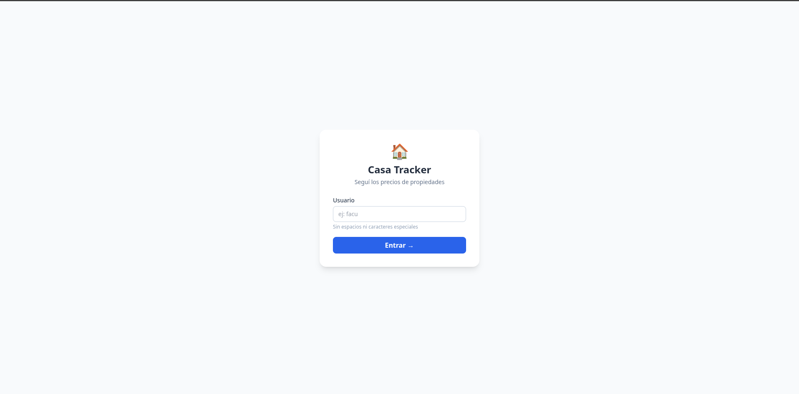
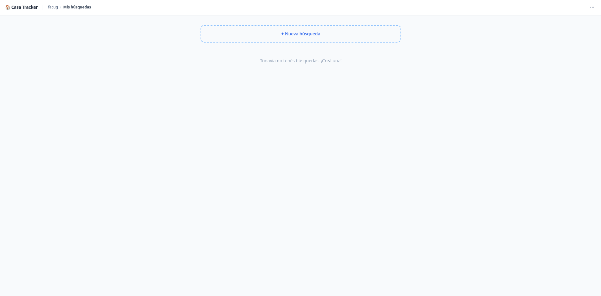
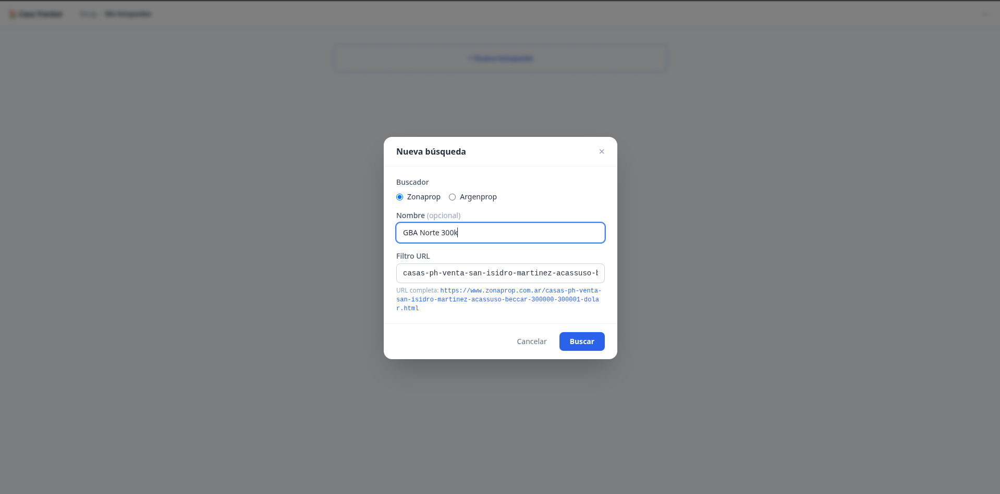
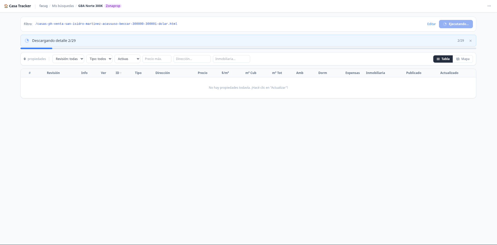
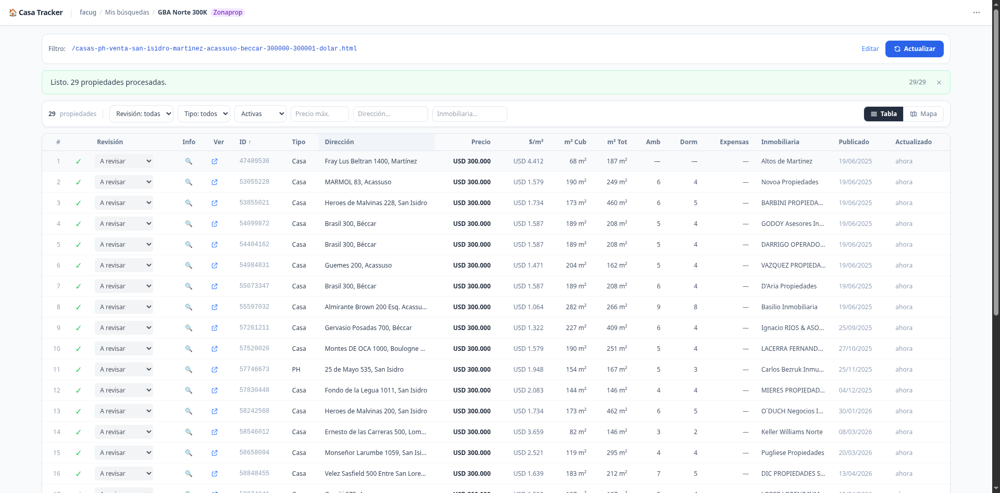
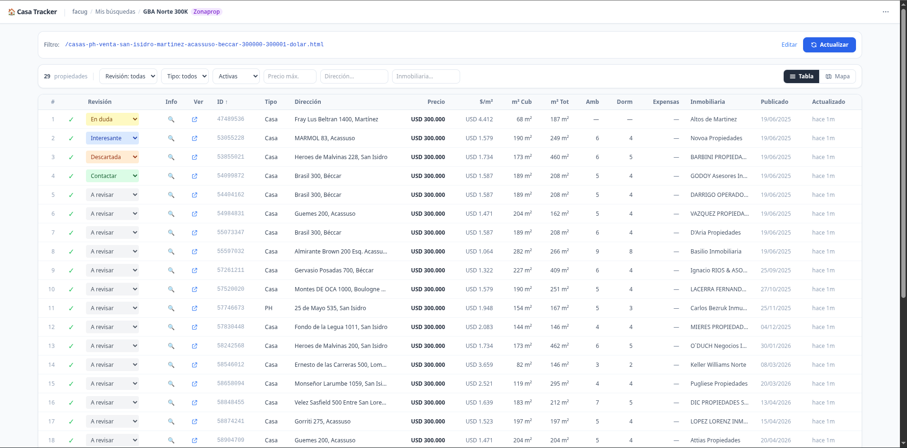
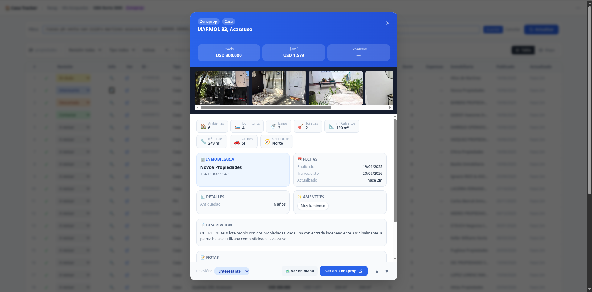
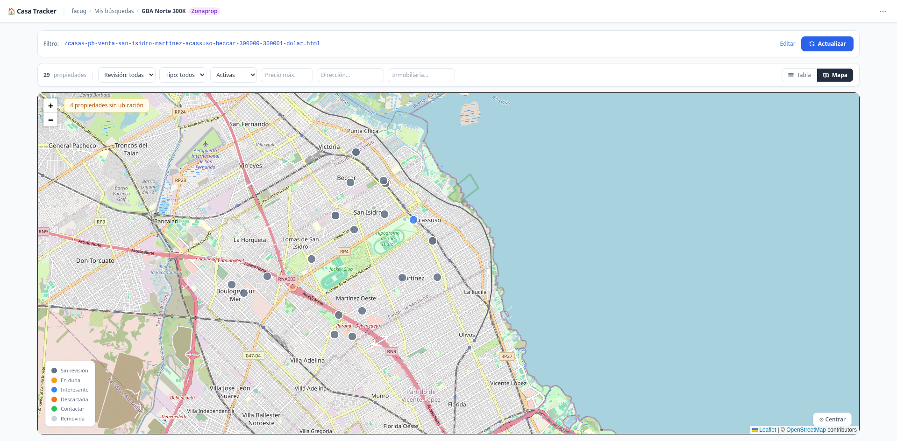
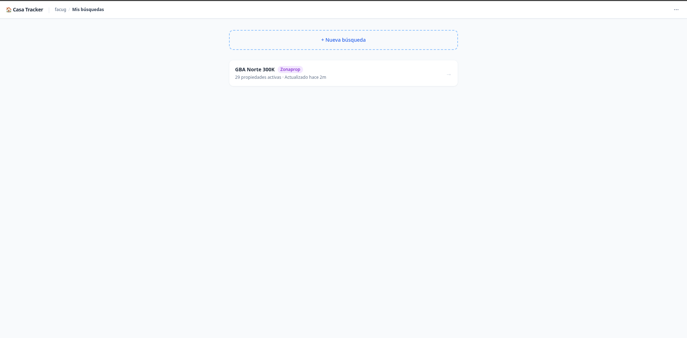

# 🏠 Mudate - home search

Track and compare real estate listings from **Zonaprop** and **Argenprop**.  
Filter, review, map, and export properties — all from a single self-hosted web app.

---

## Features

- **Scrapes** Zonaprop and Argenprop using Playwright (stealth mode — handles JS-heavy pages)
- **Tracks price history** — every price change is recorded per property
- **Geocodes addresses** and shows pins on an interactive map (Leaflet + Nominatim)
- **Filter & sort** by status, type, review, price, m², and more
- **Review system** — mark properties as Interesting, Contact, Discard, or Unsure
- **Export to CSV** — respects active filters
- **Daily auto-refresh** — a scheduler re-scrapes all sessions every morning at 08:00 (Argentina time)
- **No build step** — frontend is plain HTML/JS (Alpine.js + Tailwind CDN)
- **Single-file database** — everything stored in `db.json`

---

## Quick Start

### Option A — Docker *(recommended)*

Requires [Docker Desktop](https://www.docker.com/products/docker-desktop/) (Mac/Windows) or Docker Engine (Linux).

```bash
git clone https://github.com/YOUR_USERNAME/mudate.git   # replace YOUR_USERNAME with your fork URL
cd mudate
docker compose up
```

Open **http://localhost:8000** — that's it.

Data is saved to `./data/db.json` on your machine and survives container restarts.

To run in the background:
```bash
docker compose up -d
docker compose logs -f   # follow logs
docker compose down      # stop
```

---

### Option B — Railway *(cloud, zero local setup)*

Deploy your own instance to [Railway](https://railway.app) with one click:

[](https://railway.app/new/template)

> **Note:** For persistent storage on Railway, attach a Volume and set `DB_PATH` to a path inside it (e.g. `/data/db.json`). Without a volume the database resets on every deploy.

---

### Option C — Manual *(Python 3.11+, Linux)*

#### 1. Install system dependencies

```bash
# Debian/Ubuntu
sudo apt update && sudo apt install -y python3 python3-venv python3-pip git

# Playwright browser dependencies (required for headless Chrome)
sudo apt install -y libnss3 libatk1.0-0 libatk-bridge2.0-0 libcups2 \
  libdrm2 libxkbcommon0 libxcomposite1 libxdamage1 libxfixes3 libxrandr2 \
  libgbm1 libpango-1.0-0 libcairo2 libasound2t64 libwayland-client0

# Fedora/RHEL
sudo dnf install -y python3 python3-virtualenv git
sudo dnf install -y nss atk at-spi2-atk cups-libs libdrm libxkbcommon \
  libXcomposite libXdamage libXfixes libXrandr mesa-libgbm pango cairo alsa-lib wayland-libclient

# Arch Linux
sudo pacman -S python python-virtualenv git

# Playwright browser dependencies
sudo pacman -S nss atk at-spi2-core cups libdrm libxkbcommon libxcomposite \
  libxdamage libxfixes libxrandr mesa pango cairo alsa-lib
```

#### 2. Clone and set up the project

```bash
git clone https://github.com/YOUR_USERNAME/mudate.git   # replace YOUR_USERNAME with your fork URL
cd mudate/backend

# Create virtual environment
python3 -m venv .venv

# Install Python dependencies
.venv/bin/pip install -r requirements.txt

# Install Playwright Chromium browser (~180 MB download)
.venv/bin/playwright install chromium
```

#### 3. Run the app

```bash
.venv/bin/uvicorn main:app --host 0.0.0.0 --port 8000 --reload
```

Open **http://localhost:8000**.

#### 4. (Optional) Run as a background service

To keep the app running after closing the terminal:

```bash
# Option A: nohup
nohup .venv/bin/uvicorn main:app --host 0.0.0.0 --port 8000 > /tmp/mudate.log 2>&1 &

# Option B: systemd user service
mkdir -p ~/.config/systemd/user
cat > ~/.config/systemd/user/mudate.service << 'EOF'
[Unit]
Description=Casa Tracker
After=network.target

[Service]
Type=simple
WorkingDirectory=%h/mudate/backend
ExecStart=%h/mudate/backend/.venv/bin/uvicorn main:app --host 0.0.0.0 --port 8000
Restart=on-failure

[Install]
WantedBy=default.target
EOF

systemctl --user daemon-reload
systemctl --user enable --now mudate
```

#### 5. (Optional) Set environment variables

```bash
export OPENCAGE_API_KEY=your_key_here   # improves geocoding accuracy
export DB_PATH=/path/to/db.json         # custom database location
```

---

## Configuration

All settings are passed as environment variables.

| Variable | Default | Description |
|---|---|---|
| `DB_PATH` | `../db.json` | Path to the JSON database file |
| `OPENCAGE_API_KEY` | *(empty)* | Optional — improves geocoding accuracy. Free tier: 2 500 req/day. Get one at [opencagedata.com](https://opencagedata.com/api#free-trial) |

**With Docker**, set variables in a `.env` file next to `docker-compose.yml`:

```env
OPENCAGE_API_KEY=your_key_here
```

**Manually**, prefix the command:
```bash
OPENCAGE_API_KEY=your_key_here uvicorn main:app --host 0.0.0.0 --port 8000
```

---

## How to Use

1. **Enter a username** — no password, just a name to separate your data from others on the same instance.
2. **Create a search** — paste a filter URL from Zonaprop or Argenprop (the path after the domain, e.g. `/inmuebles-venta-palermo-capital-federal-argentina.html`).
3. **Click Actualizar** — the scraper runs in the background and populates the table.
4. **Review listings** — use the filter bar, open property details, add notes, mark reviews.
5. **Open the map** — addresses are geocoded automatically when you switch to map view.
6. **Export** — use the ⋯ menu to export the filtered table to CSV.

---

## Project Structure

```
mudate/
├── backend/
│   ├── main.py            # FastAPI app + API routes
│   ├── scrapers/          # Zonaprop and Argenprop scrapers (Playwright)
│   ├── geocoder.py        # Address geocoding (Nominatim → Photon → OpenCage)
│   ├── scheduler.py       # Daily auto-refresh (APScheduler)
│   ├── storage.py         # Atomic JSON read/write
│   └── requirements.txt
├── frontend/
│   └── index.html         # Single-page app (Alpine.js + Tailwind + Leaflet)
├── Dockerfile
├── docker-compose.yml
└── data/                  # Created automatically — holds db.json (git-ignored)
```

---

## Updating

```bash
git pull
docker compose up --build   # rebuilds the image with the latest code
```

---

## Notes & Limitations

- **Single-user friendly** — the JSON database works well for personal use or a small group. It is not designed for many concurrent users writing at the same time.
- **Scraper fragility** — if Zonaprop or Argenprop update their HTML structure, selectors in `scrapers/zonaprop.py` and `scrapers/argenprop.py` may need to be updated.
- **Geocoding rate limit** — Nominatim enforces 1 request/second. Geocoding a large session takes time. Adding an `OPENCAGE_API_KEY` improves hit rate but the rate limit stays.
- **Argentina only** — geocoding is scoped to Argentina. Adapting to other countries requires changes in `geocoder.py`.

---

## Tech Stack

| Layer | Technology |
|---|---|
| Backend | Python 3.11, FastAPI, Uvicorn |
| Scraping | Playwright, playwright-stealth, BeautifulSoup4 |
| Scheduling | APScheduler |
| Geocoding | Nominatim, Photon, OpenCage (optional) |
| Frontend | Alpine.js, Tailwind CSS (CDN), Leaflet.js |
| Database | JSON flat file with file locking |

---

## Screenshots











---

## Troubleshooting

- **Cloudflare blocks**: If the scraper is blocked by Cloudflare, delete the browser profile directory: `rm -rf ~/.casa_tracker_browser` and restart the app.
- **Playwright install failures**: Install required system dependencies (`libnss3`, `libatk1.0-0`, `libatk-bridge2.0-0`, `libcups2`, etc.). See the Manual install instructions above for your distro.
- **Port conflicts**: If port 8000 is in use, pass `--port 8080` to uvicorn (or change the port in `docker-compose.yml`).
- **zsh activation errors**: If `source .venv/bin/activate` fails in zsh, use the direct venv path instead: `.venv/bin/uvicorn main:app --host 0.0.0.0 --port 8000`.

---

## Contributing

PRs and issues are welcome. If a scraper breaks, opening an issue with the current HTML structure is the fastest way to get it fixed.

---

## License

MIT — do whatever you want with it.
